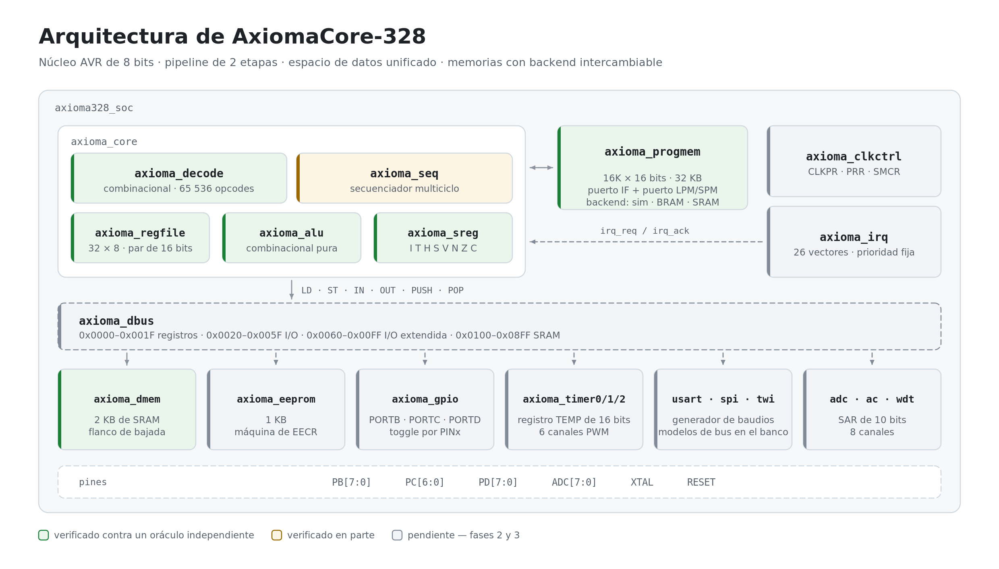
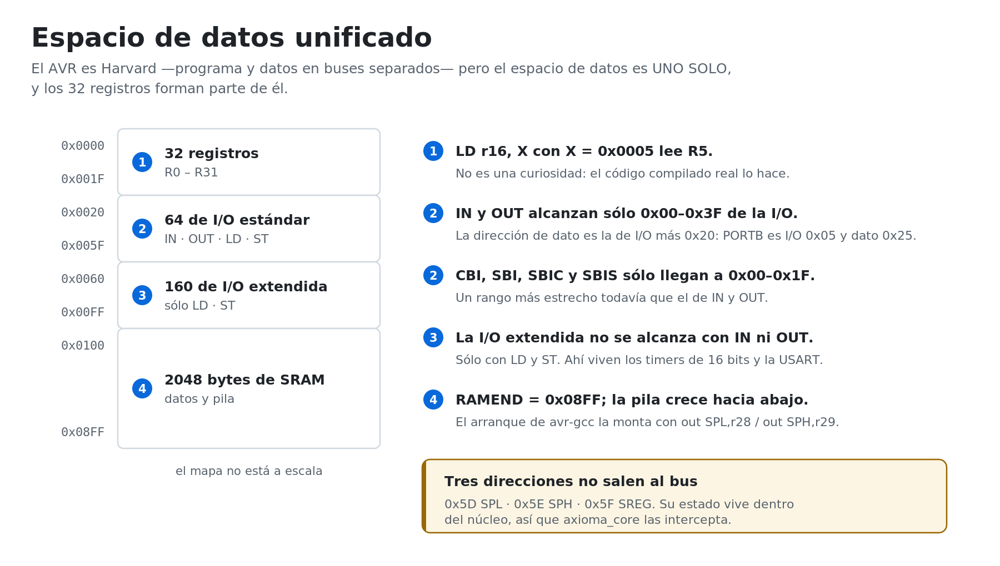
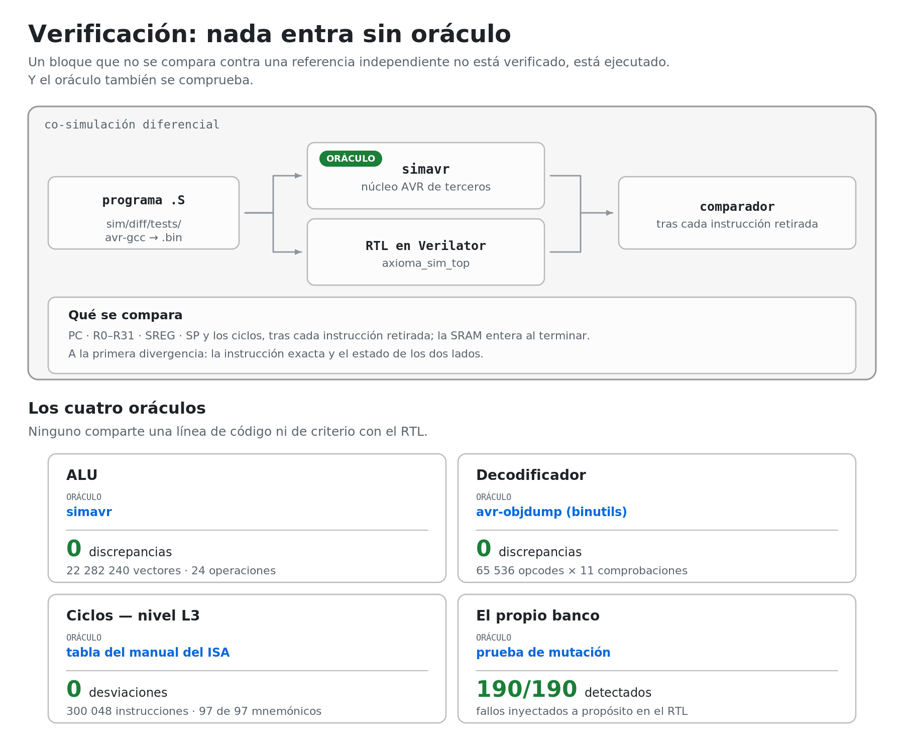
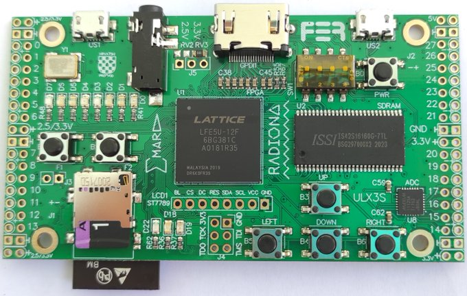

<div align="center">

# AxiomaCore-328

**Microcontrolador de 8 bits, libre y abierto, compatible a nivel binario con el ATmega328P.**

Diseñado íntegramente con herramientas libres, verificado contra oráculos independientes,
validado en FPGA y preparado para tape-out en un PDK abierto.

[](https://github.com/TadeoRoboticsGroup/AxiomaCore-328/actions/workflows/ci.yml)
[](LICENSE)
[](rtl/)
[](rtl/fpga/ecp5/)
[](docs/00-PLAN.md)
[](docs/00-PLAN.md)

</div>

---

## Arquitectura

<picture>
  <source media="(prefers-color-scheme: dark)" srcset="images/arquitectura-dark.png">
  
</picture>

Un núcleo AVR de 8 bits con pipeline de dos etapas, un secuenciador multiciclo que congela la
etapa de búsqueda, y memorias tras una interfaz pensada para cambiar de backend —simulación, BRAM
de FPGA o macros de SRAM en silicio— que es lo que evita que el port a ASIC sea una reescritura.
De esa interfaz hay hoy **una implementación**: memoria inferida, que vale para simulación y que la
síntesis mapea a BRAM; la de Sky130 es de la fase 6.

Los colores del diagrama no son decorativos: marcan qué está contrastado contra un oráculo
independiente y qué no. Ése es el criterio con el que se mide este proyecto.

---

## Estado actual

Cada cifra de esta tabla sale de ejecutar `make`, no de escribirla a mano. Dos son derivadas y
conviene decirlo: las de `progmem` y `dmem` son el desglose de las 34 049 comprobaciones que
imprime `make sim-mem`, y la de la tabla de ciclos es la suma de los dieciséis programas dirigidos.

| Bloque | Estado | Evidencia |
|--------|--------|-----------|
| `rtl/core/axioma_alu.v` | **Verificado** | 22 282 240 vectores sobre 24 operaciones, 0 fallos. Los mismos casos contrastados contra `simavr`: 0 discrepancias |
| `rtl/core/axioma_sreg.v` | **Verificado** | 200 029 comprobaciones contra un modelo sombra |
| `rtl/core/axioma_regfile.v` | **Verificado** | 800 064 comprobaciones en 200 000 ciclos aleatorios |
| `rtl/core/axioma_decode.v` | **Verificado** | Los 65 536 opcodes × 11 comprobaciones contra `avr-objdump`: 0 discrepancias |
| `rtl/mem/axioma_progmem.v` | **Verificado** | 12 000 comprobaciones: puerto de búsqueda, puerto de `LPM`, escritura por `SPM` y los dos puertos a la vez |
| `rtl/mem/axioma_dmem.v` | **Verificado** | 22 049 comprobaciones, incluido el barrido completo de las 2048 direcciones y la disciplina de flanco del [ADR 0001](docs/adr/0001-memorias-en-flanco-de-bajada.md) |
| `rtl/bus/axioma_dbus.v` | **Verificado** | 790 976 comprobaciones sobre las 65 536 direcciones del espacio de datos, 0 fallos |
| `rtl/periph/axioma_gpio.v` | **Verificado** | Diferencial contra `simavr` sobre los tres puertos, más 909 708 comprobaciones por máscara contra un modelo de la hoja de datos |
| `rtl/periph/axioma_timer0.v` | **Verificado** | 4 480 668 comprobaciones en 224 032 ciclos contra un modelo de la hoja de datos: los ocho modos de onda, el doble búfer de `OCR0x`, las banderas y los pines de comparación |
| `rtl/periph/axioma_prescaler.v` | **Verificado** | Ídem: es el contador **compartido** con el Timer1, y la trampa nº 12 —que arrancar un temporizador no lo pone a cero— sólo se puede comprobar con los dos juntos |
| `rtl/periph/axioma_irq.v` | **Verificado** | **Exhaustivo**: las 67 108 864 combinaciones de las 26 peticiones, 201 326 592 comprobaciones de prioridad y reconocimiento |
| `rtl/periph/axioma_timer1.v` | **Verificado** | **4 475 970 comprobaciones** contra un modelo de la hoja de datos: los 16 modos de onda, la captura de entrada con su cancelador de ruido, y **el registro TEMP compartido** —la trampa nº 4—, que simavr no modela |
| `rtl/periph/axioma_usart.v` | **Verificado** | **45 313 comprobaciones** contra un extremo escrito desde la hoja de datos que decodifica el pin. **Asíncrono:** las cinco longitudes de palabra, las tres paridades, uno y dos bits de parada, con y sin U2X, el periodo de bit exacto, el búfer de dos niveles y la búsqueda de errores. **Síncrono:** el periodo de `XCK` medido contra `f_CPU/(2·(UBRR+1))`, las dos polaridades de `UCPOL` —comprobadas **en el flanco**, no sólo por el dato—, de maestro y de esclavo, y 150 transacciones aleatorias. **`MPCM`:** las tramas de datos se tiran en silencio y las de dirección entran, con el tipo en el noveno bit o en el primero de parada según el tamaño |
| `rtl/periph/axioma_timer2.v` | **Verificado** | **4 666 627 comprobaciones** contra un modelo de la hoja de datos: las ocho tomas de su **prescaler propio** —incluidas `/32` y `/128`, que los otros dos no tienen—, que `PSRASY` lo ponga a cero y `PSRSYNC` no lo toque, y el **modo asíncrono**, que cuenta `TOSC1` y sin cristal no cuenta |
| `rtl/periph/axioma_timer8.v` | **Verificado** | La máquina de forma de onda de 8 bits, **una sola vez para el Timer0 y el Timer2**: la hoja de datos los describe con las mismas palabras. La ejercitan los dos bancos, y un mutante inyectado en ella muere en los dos |
| `rtl/periph/axioma_spi.v` | **Verificado** | **Maestro y esclavo**, contra el otro extremo del cable escrito desde la hoja de datos: los cuatro modos de `CPOL`/`CPHA` por los dos órdenes de bit, las ocho divisiones de reloj, `WCOL`, la secuencia de dos accesos que limpia `SPIF`, y que la colisión de maestros **no** salte cuando `SS` es salida —que es como selecciona a su esclavo cualquier sketch— |
| `rtl/periph/axioma_twi.v` | **Verificado** | **5 957 comprobaciones** contra un **bus de colector abierto** con un maestro y un esclavo I2C escritos desde la hoja de datos: los 26 códigos de estado de las tablas 21-2 a 21-6, las 128 direcciones de esclavo una por una, `TWAMR` contrastada contra su fórmula sobre las 128, la llamada general, el **arbitraje** —perder, no perder con los ceros propios, y perder siendo además el llamado, que da 0x68 y no 0x38—, el **estiramiento de reloj**, el error de bus y el periodo de `SCL` medido contra `f_CPU/(16+2·TWBR·4^TWPS)` en ocho combinaciones |
| `rtl/periph/axioma_extint.v` | **Verificado** | **2 501 159 comprobaciones** contra un modelo de la hoja de datos, más un programa de co-simulación contra `simavr`: los cuatro modos de `ISCn`, el de **nivel bajo** —que no deja bandera y sostiene la petición—, que la bandera se ponga con el vector deshabilitado, y que `PCMSKn` filtre la bandera mientras `PCICR` sólo filtra el salto |
| `rtl/periph/axioma_gpior.v` | **Verificado** | `GPIOR0/1/2`, tres bytes de almacenamiento del 328P. Diferencial contra `simavr` y barrido del mapa |
| `rtl/fpga/ecp5/axioma_ulx3s_top.v` | **Sintetiza y cierra timing** | Bitstream de 289 KB para la ULX3S 25F. `nextpnr` mide **Fmax 20,23 MHz** tras el rutado, bajo restricción exigente; se corre a 12,5 MHz, con un margen de 1,62× |
| `fw/hello/hello.c` | **Verificado** | **El criterio de aceptación de la fase 2, menos el cable.** C compilado con avr-gcc y avr-libc sin modificar, corriendo sobre el SoC completo: el banco decodifica el **pin** y lee `Hola, AxiomaCore-328`, mide 19 055 baudios contra 19 200 nominales (−0,76 %), ve parpadear PB5, **decodifica del pin una transacción SPI** de tres bytes con el reloj de `SCK`, y **mide el ciclo de trabajo de los SEIS canales PWM a la vez**, cada uno en su pin y con un ciclo distinto a propósito —25,39 · 78,50 · 37,49 · 74,86 · 12,49 · 62,48 %—, contra lo que da la hoja de datos. Seis cifras distintas es lo que hace visible un mapa de pines cruzado |
| `fw/blink/blink.c` | **Verificado** | C compilado con avr-gcc y avr-libc **sin modificar**: 50 000 instrucciones contra `simavr`, exactas en ciclos, con 4 entradas a ISR |
| `rtl/soc/axioma328_soc.v` | **Verificado** | **La integración es diseño, no banco de pruebas.** Las 224 direcciones del espacio de I/O barridas por el bus real: sin colisiones, el mapa coincide con la hoja de datos y los huecos se leen como `0x00` |
| `rtl/core/axioma_seq.v` | **Verificado** | 16 programas dirigidos + 10⁶ instrucciones aleatorias, 0 divergencias en estado, ciclos y espacio de datos |
| `rtl/core/axioma_core.v` | **Verificado** | Ídem. Es el módulo que une todo |
| Tabla de ciclos (nivel L3) | **Verificada** | 300 048 instrucciones con sus ciclos contrastados contra el manual, 0 desviaciones · **97 de 97 mnemónicos** |
| Regresión aleatoria | **Verde** | 10 programas × 100 000 instrucciones generadas con semilla fija, 0 divergencias |
| Entrada a interrupción | **Verificada** | 1 172 entradas a ISR contrastadas contra `simavr`, que ejecuta su propia secuencia de entrada: vector, pila, `SP` y bit `I`. Cuesta 4 ciclos, como dice el manual. Encontró dos fallos reales (ver abajo) |
| ADC, EEPROM, watchdog, comparador analógico | Pendientes | Fase 3 |
| Síntesis FPGA, GDSII | No ejecutadas | Fases 2 y 6 |

```
regresión   28/28 objetivos en verde
mutación   190/190 fallos inyectados, 190 detectados
cobertura   99,5 % del RTL, fusionando todas las fuentes
            17 de 22 módulos al 100 %; los 12 puntos restantes, adjudicados:
            los `default` inalcanzables de la ALU y del TWI —sus casos están
            enumerados—, el `$readmemh` que sólo corre con programa precargado,
            el `next_warmup` que sólo pone el reset, y líneas de declaración cuyos
            bits van atados a constante
síntesis    sin latches · el SoC entero: 8 259 LUT4 y 1 211 FF en el ECP5
bitstream   289 KB · 33 % de las LUT y 58 % de la BRAM de la ULX3S 25F
            Fmax 20,23 MHz medida tras el rutado, y se corre a 12,5 MHz
```

**La fase 1 cumple su criterio de aceptación, y su única deuda está saldada.** La entrada a
interrupción, que no se podía ejercitar sin un controlador, ya se dispara desde el Timer0. Al
hacerlo aparecieron **dos fallos reales** en esa ruta: el secuenciador calculaba la dirección del
vector multiplicando por cuatro en vez de por dos, y su máquina de estados de entrada se caía al
`case` de instrucciones en los ciclos 1 a 3, porque la condición que la sostenía dejaba de
cumplirse en cuanto el primer ciclo limpiaba el bit `I`.

**Cuánto queda, y medido contra qué.** El [plan](docs/00-PLAN.md) presupuesta las fases en semanas:
1 + 4 + 2 + 5 + 3 + 2 = **17 semanas** hasta la v1.0 sobre FPGA, y de 6 a 10 más si hay silicio.
Con las fases 0 y 1 cerradas, la 2 **cumplida en simulación** —a falta de enchufar la placa— y la 3
con **cinco de sus diez periféricos** dentro —Timer1, Timer2, las interrupciones externas, el
SPI y el TWI—, salen **~49 % hasta la v1.0 en FPGA** y **~34 % contando el silicio**. Es el presupuesto del propio plan,
no una impresión.

> Este README documenta el estado **medido**. Una versión anterior describía un diseño terminado
> y listo para producción que no existía. La regla desde entonces es simple: si no hay un comando
> que lo demuestre, no se afirma.

**➜ El plan completo está en [`docs/00-PLAN.md`](docs/00-PLAN.md).**

---

## Qué significa «compatible»

«Copia exacta» significa cosas distintas según a quién se pregunte. Aquí está fijado por escrito
en cuatro niveles, y sólo tres son alcanzables con herramientas libres.

| Nivel | Qué garantiza | ¿Objetivo? | Cómo se verifica |
|-------|---------------|-----------|------------------|
| **L1 — Binaria** | 131 instrucciones, semántica exacta del SREG, PC de 14 bits, pila, interrupciones | Obligatorio | Diferencial contra `simavr`, instrucción a instrucción |
| **L2 — Registros** | Mismas direcciones, nombres y bits. `avr/io.h` con `-mmcu=atmega328p` funciona sin tocar nada | Obligatorio | Mapa generado desde `iom328p.h` de avr-libc, con test de CI |
| **L3 — Ciclos** | Misma cuenta de ciclos por instrucción y misma temporización de periféricos | Sí | Tabla del manual del ISA como fichero de datos, comprobada en cada instrucción retirada |
| **L4 — Eléctrica** | 5 V, DIP-28, pinout idéntico | **No en el die.** Sí en el módulo | Sky130 no da 5 V; se resuelve con level shifters en la PCB |

De L3 dependen `_delay_ms()`, `micros()`, `SoftwareSerial`, `Servo` y cualquier protocolo
bit-bangeado como el de las tiras NeoPixel. Por eso se mide desde la fase 1 y no al final.

---

## Espacio de datos

<picture>
  <source media="(prefers-color-scheme: dark)" srcset="images/espacio-datos-dark.png">
  
</picture>

El AVR es Harvard, pero su espacio de **datos** es uno solo y los registros forman parte de él.
Modelarlo de otro modo produce un núcleo que pasa los tests sintéticos y falla con código
compilado real.

---

## Verificación

<picture>
  <source media="(prefers-color-scheme: dark)" srcset="images/verificacion-dark.png">
  
</picture>

### La regla

> **Nada entra sin oráculo. Y el oráculo también se comprueba.**

Un módulo que compila y sintetiza no cuenta como hecho. Cuenta cuando lo contrasta algo
independiente. Y como el modelo de referencia y el RTL los escribe la misma persona, hacen falta
terceros de verdad: `simavr` para la ALU y para el núcleo completo, `avr-objdump` de binutils para
el decodificador, el preprocesador de avr-gcc para el mapa de registros.

### No es teoría: fallos que sólo aparecieron así

| Fallo | Quién lo encontró | Por qué se escapaba |
|-------|-------------------|---------------------|
| Flag `H` de `NEG` implementado como `R3 \| ¬Rd3` en vez de `R3 \| Rd3` | Contraste contra `simavr` | El mismo error estaba en el RTL **y** en el modelo de referencia, así que coincidían en los 65 536 vectores de `NEG` y ninguno podía delatar al otro. Corregir sólo uno de los dos produce **32 768 discrepancias**, medidas |
| Desfase de un ciclo en la búsqueda: cada instrucción se ejecutaba dos veces | Co-simulación diferencial | Apareció en la segunda instrucción del primer programa |
| `RET` devolvía el byte bajo duplicado | Co-simulación diferencial | Consumía la lectura de memoria del ciclo equivocado |
| `MOVW` costaba 2 ciclos donde el manual dice 1 | Comprobación de ciclos | El **estado** quedaba correcto, así que la comparación de estado lo daba por bueno |
| Cinco fallos en los propios bancos de pruebas | Prueba de mutación | El arnés de memoria no distinguía flanco de subida de bajada; el comparador del decodificador no miraba `alu_op`, con lo que confundir `ADD` con `ADC` pasaba el test |
| El arnés no comparaba la memoria | Auditoría de cobertura | `ST`, `STS`, `PUSH`, `OUT`, `SBI` y `CBI` escriben sin leer: una escritura a la dirección equivocada sólo se notaba si el programa la releía |

El caso de `MOVW` es el que mejor explica por qué hay tantas capas: la causa no estaba en el
secuenciador sino en la **interfaz** del banco de registros, que direccionaba lectura y escritura
de 16 bits con el mismo índice de par. Copiar de un par a otro exigía dos ciclos. El documento de
arquitectura ya decía que debía costar uno; el que contradecía al documento era el RTL.

### Reproducirlo

```bash
source env.sh
make check-tools
make lint synth-check regmap-check lpf check-docs sim-alu sim-sreg sim-regfile sim-mem \
     sim-dbus sim-gpio sim-timer0 sim-timer1 sim-timer2 sim-usart sim-spi \
     sim-extint sim-irq sim-soc \
     sim-robust sim-fw sim-hello sim-simavr sim-decode sim-diff sim-random coverage
```

Los veintisiete objetivos deben pasar. Tarda menos de un minuto en un portátil.

La co-simulación diferencial recoge sola cualquier `.S` que aparezca en `sim/diff/tests/`. Hoy son
**dieciséis programas**: tres de aritmética, control de flujo y memoria; cuatro dirigidos que
completan el conjunto de instrucciones —bits y espacio de I/O, las 16 ramas condicionales, `LPM` en
sus tres formas, y el control del sistema—; uno de puertos de E/S; uno que escribe por la USART sin
interrupciones; y siete que entran en la rutina de interrupción de verdad, desde los tres
temporizadores, la USART, el SPI, el TWI y los cinco vectores externos. Entre todos ejercitan
**los 97 mnemónicos** que el ATmega328P puede ejecutar. Tras cada instrucción se comparan PC, los 32 registros, SREG, SP y los ciclos; al
terminar, la SRAM entera byte a byte.

> **97 mnemónicos y 131 instrucciones no se contradicen.** La cifra de 131 es la del manual del ISA
> y cuenta variantes que comparten codificación: `LSL` es `ADD Rd,Rd`, `CLR` es `EOR Rd,Rd`, `TST`
> es `AND Rd,Rd`, `SER` es `LDI Rd,0xFF`, y `BRBS`/`BRBC` se despliegan en dieciséis ramas con
> nombre propio. La cobertura se mide en mnemónicos porque es lo que devuelve `avr-objdump`, que es
> el oráculo: así el número sale de una herramienta y no de un recuento a mano. Los 97 son todos
> los que el 328P puede ejecutar; `SPM` es la única exclusión y es deliberada.

```bash
make mutation      # ~6 min · inyecta 74 fallos y comprueba que la regresión los caza
```

A eso se le suman **10⁶ instrucciones aleatorias** (`make sim-random`): programas válidos con
operandos aleatorios, generados con semilla fija, de modo que un fallo se reproduce exactamente con
el mismo comando. Lo difícil de un generador así no es la aleatoriedad, sino garantizar que nunca
hace algo cuyo resultado no esté definido o que los dos lados no puedan modelar igual; las
restricciones y su porqué están documentadas en la cabecera del generador.

Además, `SPM` queda fuera de la suite a propósito: el manual no le fija un número de ciclos
—dependen del backend de memoria de programa— y su emulación en simavr no es comparable.

`make mutation` **modifica el RTL en sitio** mientras corre. Tiene cerrojo y manejadores de señal,
pero no debe ejecutarse en paralelo con nada más.

Para depurar el núcleo, el arnés señala la instrucción exacta donde diverge, con el estado de los
dos lados:

```bash
./build/vdiff/diff build/diff/flow.bin
```

Estrategia completa, en seis capas: [`docs/03-verificacion.md`](docs/03-verificacion.md).

---

## Plataforma de validación

<div align="center">
  
</div>

<div align="center">
  <sub>
    ULX3S · fotografía del repositorio <a href="https://github.com/emard/ulx3s">emard/ulx3s</a>,
    © 2016-2018 EMARD, bajo licencia tipo MIT. La unidad fotografiada monta un LFE5U-12F;
    la variante objetivo de este proyecto es la de <strong>25F</strong>, misma placa.
  </sub>
</div>

La **ULX3S 25F** es la plataforma primaria: ECP5 `LFE5U-25F`, 24 k LUT4 y 1008 Kbit de EBR, con
toolchain completamente libre (yosys + nextpnr-ecp5 + prjtrellis). Sobra memoria para los 32 KB de
programa, los 2 KB de SRAM y el 1 KB de EEPROM, y sobran pines para sacar los tres puertos.

| Placa | FPGA | Lógica | Memoria | Precio aprox. | Papel |
|-------|------|--------|---------|---------------|-------|
| **ULX3S 25F** | ECP5 LFE5U-25F | 24 k LUT4 | 1008 Kbit EBR + 32 MB SDRAM | ~120 USD | **Primaria.** Recursos de sobra y mucha E/S |
| Colorlight 5A-75B | ECP5 LFE5U-25F | 24 k LUT4 | 1008 Kbit + SDRAM | ~20 USD | Mejor relación precio/prestaciones; necesita placa adaptadora |
| Tang Nano 9K | Gowin GW1NR-9 | 8,6 k LUT4 | 468 Kbit BSRAM | ~18 USD | Secundaria. Toolchain abierta algo menos madura |
| iCEBreaker | iCE40 UP5K | 5,3 k LUT4 | 128 KB SPRAM | ~70 USD | Secundaria. La cadena más madura; ajustado en LUTs |

El SoC es el mismo para las tres familias: sólo cambian el top y las constraints bajo
`rtl/fpga/`. Las constraints de la ULX3S **se generan** desde el fichero oficial de la placa
(`make lpf`, 36 pines), de modo que ningún pin puede quedar mal transcrito.

**Objetivo de rendimiento:** cierre de timing a ≥ 32 MHz en ECP5, el doble de un ATmega328P real,
con F_CPU seleccionable (8/16/20/25/32 MHz) para correr binarios de Arduino sin recompilar.

---

## Cadena de herramientas

100 % libre, de la especificación al GDSII. Sin una sola herramienta propietaria.

| Etapa | Herramienta |
|-------|-------------|
| Simulación RTL | Verilator · Icarus Verilog |
| **Oráculo del núcleo** | **simavr** |
| **Oráculo del decodificador** | **avr-objdump** (binutils) |
| Compilación de los tests | avr-gcc · avr-libc |
| Síntesis | Yosys |
| Place & route | nextpnr + prjtrellis / icestorm / apicula |
| Carga del bitstream | openFPGALoader |
| Verificación formal | SymbiYosys |
| RTL → GDSII | LibreLane 3.x + Sky130A (vía `ciel`) |
| DRC / LVS | Magic · Netgen · KLayout |

### Instalación

Casi todo llega en un único paquete:

```bash
mkdir -p ~/eda && cd ~/eda
curl -LO https://github.com/YosysHQ/oss-cad-suite-build/releases/download/2026-09-08/oss-cad-suite-linux-x64-20260908.tgz
tar xzf oss-cad-suite-linux-x64-20260908.tgz
```

El resto —toolchain AVR, `simavr` y el entorno de Python— está en
[`INSTALL.md`](INSTALL.md), incluida la vía **sin `sudo`**. Después:

```bash
source env.sh
make check-tools
```

---

## Hoja de ruta

| Fase | Contenido | Estado |
|------|-----------|--------|
| 0 | Fundación: estructura, licencias, generador del mapa de registros, CI | **Hecha** |
| **1** | **Núcleo ISA: ALU, SREG, banco, decodificador, secuenciador, memorias, oráculos** | **Hecha** — criterio de aceptación cumplido |
| 2 | SoC mínimo: bus de datos, GPIO, Timer0, USART, IRQ. Primer bitstream | Pendiente |
| 3 | Periféricos completos: Timer1 con registro TEMP, SPI, TWI, ADC, EEPROM | Pendiente |
| 4 | Compatibilidad Arduino: bootloader STK500v1 propio, paquete para el IDE | Pendiente |
| 5 | Endurecimiento: cierre de timing, portes a iCE40 y Gowin, regresión nocturna | Pendiente |
| 6 | Silicio: backend Sky130, LibreLane, Tiny Tapeout y chipIgnite | Pendiente |
| 7 | Módulo DIP-28 en KiCad, compatible con el zócalo de un Arduino Uno | Pendiente |

Criterio de aceptación de la fase 1, sin ambigüedad, y su estado:

| Requisito | Estado |
|-----------|--------|
| El conjunto de instrucciones pasa el diferencial contra simavr | 97/97 mnemónicos, en 16 programas dirigidos |
| 10⁶ instrucciones aleatorias sin divergencia | 10⁶, 0 divergencias |
| ALU 100 % exhaustiva verde | 22 282 240 vectores, 0 fallos |
| Tabla de ciclos exacta | 97/97 mnemónicos, 0 desviaciones |

La **fase 2** está en marcha: ya están el bus de datos, los puertos de E/S, el Timer0 con su
prescaler compartido y el controlador de interrupciones —que desbloqueó la única parte del
secuenciador que no se podía ejercitar—. Quedan la USART, el top de ECP5 y el backend de BRAM,
y con ellos el primer bitstream con un LED parpadeando en la FPGA.

---

## Estructura del repositorio

```
rtl/      core · bus · mem (backends/: marcadores vacíos hasta la fase 6) · periph · soc · fpga
sim/      alu · decode · mem · diff (co-simulación) · perf (tabla de ciclos) · isa
tools/    generadores: gen_regmap.py · gen_ulx3s_lpf.py · gen_diagrams.py
docs/     plan, arquitectura, verificación, legal, ADR
fw/       bootloader · selftest · examples
sw/       arduino · platformio · avrdude
asic/     librelane · macros · reports
board/    KiCad: módulo DIP-28
legacy/   proyecto anterior, congelado como referencia
```

**Regla estructural:** cada fichero RTL existe **una sola vez**. Las herramientas reciben listas de
ficheros, nunca copias del árbol de fuentes.

### Ficheros generados, nunca escritos a mano

Una transcripción manual se desincroniza y nadie se entera hasta que algo falla.

| Generado | Desde | Garantiza |
|----------|-------|-----------|
| `rtl/soc/axioma_regmap.vh` · `docs/05-register-map.md` | `iom328p.h` de avr-libc | El nivel L2 de compatibilidad |
| `rtl/fpga/ecp5/axioma_ulx3s.lpf` | Fichero de constraints oficial de la ULX3S | Que ningún pin esté mal transcrito |
| `build/perf/cycles.bin` | La tabla del manual, vía el mnemónico de `avr-objdump` | El nivel L3 de compatibilidad |
| `images/*.png` | `tools/gen_diagrams.py` | Que las figuras no se desincronicen del diseño |

La CI falla si los dos primeros están desactualizados.

---

## Documentación

| Documento | Contenido |
|-----------|-----------|
| [`docs/00-PLAN.md`](docs/00-PLAN.md) | **Plan maestro.** Decisiones, fases, presupuesto de área, riesgos. Empieza aquí |
| [`docs/01-arquitectura.md`](docs/01-arquitectura.md) | Microarquitectura, mapa de datos, vectores, tabla de ciclos, las doce trampas |
| [`docs/03-verificacion.md`](docs/03-verificacion.md) | Estrategia de verificación en seis capas |
| [`docs/02-legal.md`](docs/02-legal.md) | Política clean-room y análisis de licencias |
| [`docs/04-herramientas.md`](docs/04-herramientas.md) | Cadena de herramientas |
| [`docs/05-register-map.md`](docs/05-register-map.md) | Mapa de registros y vectores. **Generado** |
| [`docs/adr/`](docs/adr/) | Registros de decisiones de arquitectura |
| [`INSTALL.md`](INSTALL.md) | Instalación desde cero, con y sin `sudo` |
| [`requerimiento.md`](requerimiento.md) | Requerimiento oficial del proyecto |

---

## Licencia y marco legal

**Apache-2.0** para RTL, bancos de pruebas, scripts y firmware, elegida por su concesión explícita
de patentes, que en hardware importa. El diseño físico irá bajo **CERN-OHL-P v2** y la
documentación bajo **CC-BY-4.0**. Ver [`LICENSE`](LICENSE), [`NOTICE`](NOTICE) y el inventario de
terceros en [`LICENSE-EXCEPTIONS.md`](LICENSE-EXCEPTIONS.md).

Este es un proyecto **clean-room**: se implementa desde documentación pública del conjunto de
instrucciones. No contiene RTL, layouts ni prosa de hoja de datos de terceros. Los signature bytes
son propios y no se reutilizan los del ATmega328P: hacerlo volvería el dispositivo indistinguible
de una pieza genuina, que es exactamente el escenario de falsificación. Las reglas están en
[`docs/02-legal.md`](docs/02-legal.md) y son de obligado cumplimiento para cualquier contribución.

> AVR es una marca registrada de Microchip Technology Inc. Arduino es una marca registrada de
> Arduino SA. AxiomaCore-328 es una implementación independiente, sin relación ni respaldo de
> dichas compañías.

---

## Agradecimientos

SkyWater Technology y Google por el PDK Sky130 abierto · la FOSSi Foundation por LibreLane · el
equipo de YosysHQ por Yosys, nextpnr y la OSS CAD Suite · el proyecto OpenROAD · Verilator ·
Icarus Verilog · `simavr`, sin el cual este núcleo no tendría cómo demostrar que funciona ·
EMARD y RADIONA por la ULX3S · y la comunidad de hardware abierto, que hizo posible que todo esto
se haga con un portátil y sin una sola licencia de pago.
